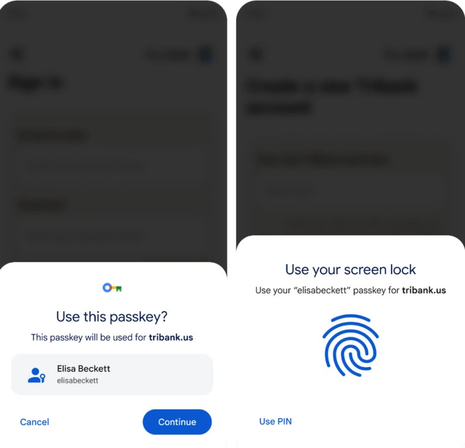
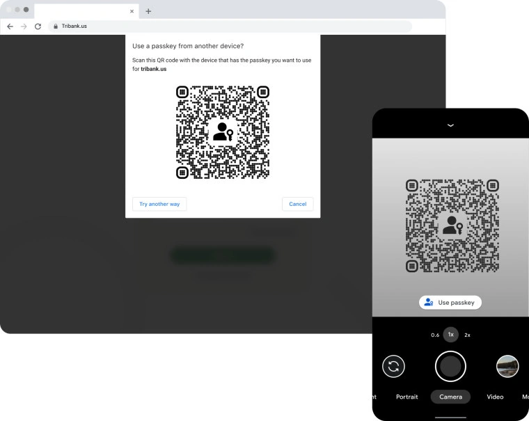

# 202210

1. [202210](#202210)
    1. [国内隐私相关](#国内隐私相关)
        1. [二十大报告中数字、网络及安全相关的金句](#二十大报告中数字网络及安全相关的金句)
    2. [海外隐私相关](#海外隐私相关)
        1. [进军无密码未来，谷歌安卓系统和 Chrome 浏览器开始测试“通行密钥”](#进军无密码未来谷歌安卓系统和-chrome-浏览器开始测试通行密钥)
        2. [优步前高管或因隐瞒数据泄露入狱](#优步前高管或因隐瞒数据泄露入狱)
        3. [泰国政府宣布该国“健康码”停止运行，销毁所有数据](#泰国政府宣布该国健康码停止运行销毁所有数据)
        4. [谷歌将于 2023 年开设首个日本数据中心](#谷歌将于-2023-年开设首个日本数据中心)

## 国内隐私相关

### 二十大报告中数字、网络及安全相关的金句

> 政策研究

- source: [二十大报告（实录全文）](https://news.ifeng.com/c/8K9l4qcZtaw)
- date: 2022-10-16

1. 总章强调网络强国和数字中国，网络生态要持续向好，推动形成良好的网络生态。
2. 提高公共安全治理水平，提到**加强个人信息保护**
3. 强化国家安全工作协调机制，完善国家安全法治体系
4. 国家安全观里面再次提到：国家安全是民族复兴的根基，社会稳定是国家强盛的前提。必须坚定不移贯彻总体国家安全观
5. 最后提到了参与**全球安全治理**

## 海外隐私相关

### 进军无密码未来，谷歌安卓系统和 Chrome 浏览器开始测试“通行密钥”

> 数据安全

- source: [进军无密码未来，谷歌安卓系统和 Chrome 浏览器开始测试“通行密钥”](https://www.ithome.com/0/646/311.htm)
- date: 2022-10-13

IT 之家 10 月 13 日消息，谷歌今天宣布安卓和 Chrome 浏览器带来初步的 Passkey 通行密钥支持。第一阶段让开发者通过使用 Google Play 服务 Beta 测试版和 Chrome Canary 来获得该技术，并让他们在其网站和应用程序中增加对该功能的支持。

谷歌希望在今年晚些时候向稳定频道推出对该功能的支持，届时一些开发者将把该技术纳入其产品。

IT 之家获悉，**通行密钥是密码的一种替代形式，旨在为各种网站和 App 提供一种更安全快捷的免密登录体验**。与密码不同，通行密钥是一种基于标准的技术。它可以抵御网络钓鱼，始终具有出色的安全性，并且从设计上避免了机密的共享。

Passkey 界面类似于 Chrome 手机用户已经熟悉的自动填充界面。使用 Passkey 就像选择要登录的账户一样简单，然后使用用户指纹、人脸或屏幕锁来获得访问权。如果用户愿意，还可以使用手机上的密码在附近的设备上登录。如果想在电脑上登录网站，可以提供二维码，并使用手机扫描来批准访问。

谷歌的下一个里程碑是将 API 支持引入原生安卓应用。在他们的应用程序中建立支持的开发者将允许用户选择使用 Passkey 或密码来登录。随着 Passkey 的普及，创建和记住密码的需求将减少，这可能导致黑客入侵账户的情况减少。

Passkey 是一个行业标准，作为 FIDO 联盟和 W3C 的一部分，苹果、微软和谷歌都对其进行了投入，致力于构建无密码未来。

### 优步前高管或因隐瞒数据泄露入狱

> 数据泄露

- source: [优步前高管或因隐瞒数据泄露入狱，企业该如何应对黑客勒索？](https://www.sohu.com/a/591698318_161795)
- date: 2022-10-11

10 月 5 日，对 Uber 前首席安全官 Joseph Sullivan 一案作出裁定——Sullivan 曾试图向美国联邦贸易委员会（FTC）隐瞒 Uber 在 2016 年的数据泄露事件。据悉，Sullivan 被裁定为妨碍司法公正罪和隐瞒罪行罪，可能面临最高 5 年和最高 3 年的监禁。

这是美国首例企业高管因黑客攻击而面临刑事起诉的案件。但多位安全专家认为，Uber 可能并不是唯一一家隐瞒数据泄露事件的企业，事实上向黑客支付赎金的行为并不鲜见。不过，这起判决可能会改变企业安全专业人士处理数据泄露的方式。

作为首席安全官，Sullivan 在任上的工作涉及了 Uber 在 2014 和 2016 年遇到的两次数据泄露事件。

Sullivan 于 2015 年 4 月被聘为 Uber 首席安全官。在他上任一个月后，FTC 就 2014 年数据泄露事件向 Uber 提出了民事调查要求。此次事件涉及约 5 万名消费者的个人信息未经授权访问，包括姓名和驾照号码。Sullivan 负责陈述 Uber 为保护客户数据安全所采取的措施，并在 2016 年 11 月 4 日向 FTC 进行了宣誓作证。

在作证后十天，2016 年 11 月 14 日，Sullivan 得知 Uber 再次遭到了黑客攻击。黑客们通过电子邮件直接联系 Sullivan，称发现了 Uber 的安全漏洞并获取了数字密钥，从亚马逊云服务器盗取了大规模用户数据，包括约 5700 万 Uber 用户的记录和 60 万驾照号码，以此勒索大笔赎金。

尽管明知应立即向 FTC 报告，Sullivan 仍然隐瞒下了此事，也没有将其透露给 Uber 用户或任何其他机构。在谈判后，2016 年 12 月，Sullivan 通过比特币向黑客支付了 10 万美元，并将这笔款项掩饰为漏洞赏金计划的一部分。

作为交换，双方签署了保密协议。据调查，黑客在协议中承诺不会向任何人透露此次数据泄露事件，还做出了“没有获取或存储任何数据”的虚假陈述。2017 年 1 月，Uber 安全小组查出了这两名黑客的真实身份，要求他们以真实姓名签署新的保密协议副本。

证据表明，Sullivan 知道黑客在攻击和勒索 Uber 的同时也攻击了其他企业，并至少从其中一些企业获得了数据。后来黑客提交的认罪书表明，在 Sullivan 协助掩盖了对 Uber 的攻击之后，黑客还对另一家企业 lynda.com 进行了攻击和勒索。

### 泰国政府宣布该国“健康码”停止运行，销毁所有数据

> 数据销毁

- source: [泰国政府宣布该国“健康码”停止运行，销毁所有数据](https://www.secrss.com/articles/47595)
- date: 2022-10-01

> 泰国公共卫生部疾控厅关闭疫情追踪软件“医生胜利”，于此同时销毁系统中的所有数据。

泰国头条新闻社讯 10 月 1 日，泰国总理府副发言人拉差妲透露，为顺应自今日起将新冠视为监测性传染病的政策，泰国公共卫生部疾控厅关闭疫情追踪软件“医生胜利”，于此同时销毁系统中的所有数据。此外，外交部领事事务局也取消了针对外籍游客入境的新冠相关文件审查，如疫苗接种证明、登机前 72 小时核酸检测结果。

拉差妲表示，虽然政府降低了新冠疫情的严重性，但仍继续密切监控疫情，包括加强疫苗接种工作，尤其是老年人。此外，仍支持民众保持距离、在拥挤的地方戴口罩，轻症患者积极使用 ATK 检测。目前，政府已经为 6 个月至 4 岁的儿童提供了 300 万剂辉瑞疫苗，预计将于 10 月下旬抵达，并为全国儿童接种。

### 谷歌将于 2023 年开设首个日本数据中心

> 数据本地化

- source: [谷歌日本首个数据中心将于明年投入使用](http://www.cww.net.cn/article?id=569142)
- date: 2022-10-07

近日，赴日本访问的美国谷歌首席执行官（CEO）桑达尔·皮查伊（Sundar Pichai）在接受采访时透露了该公司在日本和亚洲的业务方针。他表示，从去年到 2024 年的 4 年里，谷歌在日本将投资 1000 亿日元（约 7 亿美元），其中一部分用于在千叶县建设数据中心。这是谷歌在日本建设的首个数据中心，预计 2023 年投入使用。

受疫情及通货膨胀等宏观经济因素影响，谷歌业绩发展中的不确定性增加，利润减少，对此，谷歌采取了一系列的举措。

其中，在投资领域的推进方面，谷歌将继续对所有定位于业务基础的人工智能（AI）进行投资，将继续致力于主力业务——互联网检索服务及视频共享服务“YouTube”的发展，还将优先投资将这些服务提供给用户所需要的基础软件（OS）“Android”及云服务等。

以地区而论，亚洲是投资重点，皮查伊明确表示“未来 10 年的增长大多来自亚洲市场”，“我们长期看好亚洲，对该地区投资的优先度很高”。

8 月，谷歌宣布将在马来西亚、泰国和新西兰设立新的云区域。就日本来看，谷歌此前已经在东京和大阪设有云区域，为当地企业提供存储和基础设施服务。此次数据中心的建设，除提高消费者使用的互联网服务的方便性之外，皮查伊还表示“希望通过我们公司的云计算业务，为日本企业的数字化变革提供支援”。
