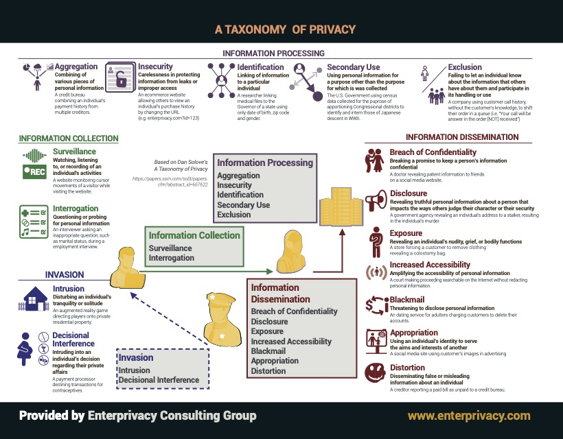
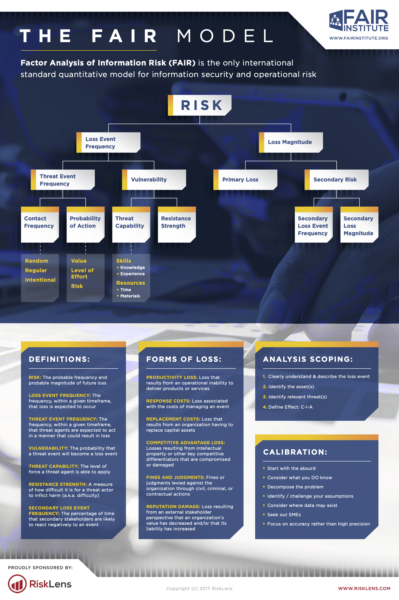

# 隐私相关原则和模型

1. [隐私相关原则和模型](#隐私相关原则和模型)
    1. [隐私经典概念](#隐私经典概念)
        1. [CIA triad](#cia-triad)
        2. [Privacy Engineering Objectives (NIST 8062)](#privacy-engineering-objectives-nist-8062)
        3. [Taxonomy of Privacy](#taxonomy-of-privacy)
        4. [Privacy Dark pattern](#privacy-dark-pattern)
        5. [FAIR：Factor Analysis of Information Risk](#fairfactor-analysis-of-information-risk)
        6. [Alan Westin- Four states of privacy](#alan-westin--four-states-of-privacy)
    2. [隐私最佳实践](#隐私最佳实践)
        1. [FIPPs (Fair Information Practice Principles)](#fipps-fair-information-practice-principles)
        2. [OECD privacy principle](#oecd-privacy-principle)
        3. [GAPP (Generally Accepted Privacy Principles)](#gapp-generally-accepted-privacy-principles)
        4. [PbD Principles](#pbd-principles)
        5. [NCASE privacy princepels](#ncase-privacy-princepels)
        6. [Australian Privacy Principles](#australian-privacy-principles)
        7. [FTC privacy framework](#ftc-privacy-framework)

## 隐私经典概念

### [CIA triad](https://www.techtarget.com/whatis/definition/Confidentiality-integrity-and-availability-CIA)
数据安全方面涉及比较重要的三个原则。
- **confidentiality**: 机密性，只有授权用户可以获取信息。
- **Integrity**: 完整性，信息在输入和传输的过程中，不被非法授权修改和破坏，保证数据的一致性。
- **Availability**: 可用性，保证合法用户对信息和资源的使用不会被不正当地拒绝。

### [Privacy Engineering Objectives (NIST 8062)](https://ethics.berkeley.edu/privacy/resources/privacy-engineering-and-risk-management-nist-8062)

类似与CIA三原则，NIST提出的关于隐私工程师需要关注的三个核心目标，简而言之，要做到可审计、可管控、脱关联。

- **Predicatability**: 可预测，行为在可控范围内。(Enabling of reliable assumptions by individuals, owners, and operators about personal information and its processing by an information system)
- **Manageability**: 可管控，个人信息精细化管理的能力。(Providing the capability for granular administration of personal information including alteration, deletion, and selective disclosure)
- **disassociability**: 可分离，脱关联匿名化。(Enabling the processing of personal information or events without association to individuals or devices beyond the operational requirements of the system)

### [Taxonomy of Privacy](./files/assets/A-Taxonomy-of-Privacy.pdf)
隐私的分类，主要基于 Dan Solove’s 的论文 A Taxonomy of Privacy，[跳转论文](https://papers.ssrn.com/sol3/papers.cfm?abstract_id=667622)

概括提纲如下，细节可以参考标题原图
- 1. INFORMATION PROCESSING
    - 1. Aggregation
    - 2. Insecurity
    - 3. Identification
    - 4. Secondary Use
    - 5. Exclusion
- 2. INFORMATION COLLECTION
    - 1. Surveillance
    - 2. Interrogation
- 3. INVASION
    - 1. Intrusion
    - 2. Decisional Interference
- 4. INFORMATION DISSEMINATION
    - 1. Breach of Confidentiality
    - 2. Disclosure
    - 3. Exposure
    - 4. Increased Accessibility
    - 5. Blackmail
    - 6. Appropriation
    - 7. Distortion

### [Privacy Dark pattern](https://www.deceptive.design/types)
Recurring solution that is used to trick individuals into giving up their privacy

- Default settings：默认设置，比如很多选项默认打开
- Cumbersome privacy choices：复杂隐私选择，比如隐私条款完全看不懂，与之相反的是苹果的折叠式条款
- Framing：多谈好处，少谈坏处
- Rewards and punishment： 利用奖励和惩罚来获取隐私
- Forced action：强制行为
- Norm shaping：诱导
- Distractions and delays：敷衍或者可以延迟

### [FAIR：Factor Analysis of Information Risk](https://www.fairinstitute.org/blog/fair-model-on-a-page)
隐私的风险分析，一般是定性分析的，FAIR尝试对于隐私的伤害进行定量分析，但是，伤害更聚焦在个人身上。

> 整体思路：Privacy Risk = probable frequency * probable magnitude of future privacy violations 

详细可以了解：https://www.fairinstitute.org/

### [Alan Westin- Four states of privacy](https://iapp.org/news/a/alan-westins-legacy-of-privacy-and-freedom/)
Alan定义了隐私的四种状态
- solitude: 独处
- intimacy: 亲密
- anonymity: 匿名
- reserve: 保留

## 隐私最佳实践

### [FIPPs (Fair Information Practice Principles)](https://iapp.org/resources/article/fair-information-practices/)
目前呈现的FIPP基于1973年美国卫生、教育和福利部的一个咨询委员会提出的建议。该委员会的报告指出，“基于保存记录的相互性概念来保障个人隐私，要求保存记录的组织遵守公平信息惯例的某些基本原则”。随后，然该报告描述了几条数据保护原则。

1980 年，OECD 扩展了这些建议，总结为FIPP。此后，FIPP 被多次引用，特别是在美国，它是数据隐私和数据保护准则中。

> FIPP目前基本成为隐私立法的一部分，可以理解为整体框架了。例如，个人参与原则（第 7 条）列出了人们应该拥有的一些权利。 CCPA 将其中一些内容编入法律，例如“知情权”，很像个人参与原则的 a) 和 b) 条款中描述的内容。GDPR 还包括“删除权”，类似于个人参与原则 d) 条款所述的“删除数据”的权力

- 1. **The Collection Limitation Principle（收集限制原则）**. There should be limits to the collection of personal data and any such data should be obtained by lawful and fair means and, where appropriate, with the knowledge or consent of the data subject.
- 2. **The Data Quality Principle（数据质量原则）**. Personal data should be relevant to the purposes for which they are to be used and, to the extent necessary for those purposes, should be accurate, complete and kept up-to-date.
- 3. **The Purpose Specification Principle（目的明确原则）**. The purposes for which personal data are collected should be specified not later than at the time of data collection and the subsequent use limited to the fulfillment of those purposes or such others as are not incompatible with those purposes and as are specified on each occasion of change of purpose.
- 4. **The Use Limitation Principle（使用限制原则）**. Personal data should not be disclosed, made available or otherwise used for purposes other than those specified, except
    - a) with the consent of the data subject, or
    - b) by the authority of law.
- 5. **The Security Safeguards Principle（安全保障原则）**. Personal data should be protected by reasonable security safeguards against such risks as loss or unauthorized access, destruction, use, modification or disclosure of data.
- 6. **The Openness Principle（开放性原则）**. There should be a general policy of openness about developments, practices and policies with respect to personal data. Means should be readily available of establishing the existence and nature of personal data and the main purposes of their use, as well as the identity and usual residence of the data controller.
- 7. **The Individual Participation Principle（个人参与原则）**. An individual should have the right:
    - a) to obtain from a data controller, or otherwise, confirmation of whether or not the data controller has data relating to him;
    - b) to have data relating to him communicated to him, within a reasonable time, at a charge, if any, that is not excessive; in a reasonable manner, and in a form that is readily intelligible to him;
    - c) to be given reasons if a request made under subparagraphs (a) and (b) is denied and to be able to challenge such denial; and
    - d) to challenge data relating to him and, if the challenge is successful, to have the data erased, rectified, completed or amended;
- 8. **The Accountability Principle（可审计原则-也叫问责原则）**. A data controller should be accountable for complying with measures which give effect to the principles stated above.

### [OECD privacy principle](http://oecdprivacy.org/)
OECD 隐私标准是当前普遍适用的针对隐私的的框架，主要包括如下八大部分

- 1. Collection Limitation Principle: 最小化收集原则
- 2. Data Quality Principle: 数据质量保证原则
- 3. Purpose Specification Principle: 目的明确原则
- 4. Use Limitation Principle: 使用限制原则
- 5. Security Safeguards Principle: 安全保障原则
- 6. Openness Principle: 开放原则
- 7. Individual Participation Principle: 用户参与原则
- 8. Accountability Principle: 可审计原则

### [GAPP (Generally Accepted Privacy Principles)](https://linfordco.com/blog/the-10-generally-accepted-privacy-principles/)
类似OECD，是美国和加拿大提出的十条隐私原则
- 1. **Management：可管控可审计原则**. The entity defines, documents, communicates, and assigns accountability for its privacy policies and procedures.
- 2. **Notice.**The entity provides notice about its privacy policies and procedures and identifies the purposes for which personal information is collected, used, retained, and disclosed.
- 3. **Choice and consent：选择和同意原则**. The entity describes the choices available to the individual and obtains implicit or explicit consent with respect to the collection, use, and disclosure of personal information.
- 4. **Collection.收集目的原则** The entity collects personal information only for the purposes identified in the notice.
- 5. **Use, retention, and disposal.限制使用原则**The entity limits the use of personal information to the purposes identified in the notice and for which the individual has provided implicit or explicit consent. The entity retains personal information for only as long as necessary to fulfill the stated purposes or as required by law or regulations and thereafter appropriately disposes of such information.
- 6. **Access.**The entity provides individuals with access to their personal information for review and update.
- 7. **Disclosure to third parties.三方披露原则** The entity discloses personal information to third parties only for the purposes identified in the notice and with the implicit or explicit consent of the individual.
- 8. **Security for privacy.隐私安全** The entity protects personal information against unauthorized access (both physical and logical).
- 9. **Quality.数据质量原则** The entity maintains accurate, complete, and relevant personal information for the purposes identified in the notice.
- 10. **Monitoring and enforcement.监控和强制执行原则** The entity monitors compliance with its privacy policies and procedures and has procedures to address privacy related complaints and disputes.

### [PbD Principles](https://www.ipc.on.ca/wp-content/uploads/resources/7foundationalprinciples.pdf)
7 Foundational Principles of privacy by design
- 1. **Proactive not Reactive**:  主动而不是被动，尽可能在问题发生之前处理
- 2. **Privacy as the Default Setting**: 隐私作为默认设置和考虑项
- 3. **Privacy Embedded into Design**: 隐私嵌入设计中，满足usable and usability
- 4. **Full Functionality — Positive-Sum, not Zero-Sum**: 隐私全功能落地，追求正向收益
- 5. **End-to-End Security — Full Lifecycle Protection**: 端对端安全，全生命周期保护
- 6. **Visibility and Transparency — Keep it Open**: 保证足够的可见性和透明性
- 7. **Respect for User Privacy — Keep it User-Centric**：尊重用户隐私，保持用户为中心

### [NCASE privacy princepels](https://www.ftc.gov/sites/default/files/documents/reports/privacy-online-report-congress/priv-23a.pdf)
NCASE是FTC提出的关于隐私的一些核心原则，其中NCASE是五个英文单词的缩写

- **Notice**: 关键信息和个数数据使用需要明确告知用户，比如隐私声明，显著披露等。
- **Choice**: 需要给到用户尽可能多的选择权和关闭权，比如个性化广告推送关闭等等。
- **Access**: 可访问或者可携带，也就是用户需要能够访问相关数据，比如数据下载功能呢
- **Security**: 保证数据安全，比如传输安全（https），存储安全（数据脱敏）等等
- **Enforcement**: 强制执行，保证可落地、可审计性和强监控
- 
### [Australian Privacy Principles](https://www.oaic.gov.au/privacy/australian-privacy-principles/australian-privacy-principles-quick-reference)
澳大利亚提出的13条隐私法案最佳实践

- 1. **Open and transparent management of personal information**: 公开透明的个人信息管理，主要通过privacy policy
- 2. **Anonymity and pseudonymity**: 匿名和假名化
- 3. **Collection of solicited personal information**: 收集公开的用户信息
- 4. **Dealing with unsolicited personal information**: 处理未经用户同意的信息
- 5. **Notification of the collection of personal information**: 收集信息要告知
- 6. **Use or disclosure of personal information**: 个人信息的使用要披露
- 7. **Direct marketing**: 个人信息仅限直销目的
- 8. **Use or disclosure of personal information**: 个人信息跨境要进行披露
- 9. **Adoption, use or disclosure of government related identifiers**: 采用、使用或者披露政府相关标识符
- 10. **Quality of personal information**: 保障个人信息质量
- 11. **Security of personal information**: 保障个人信息安全
- 12. **Access to personal information**: 个人信息的访问控制
- 13. **Correction of personal information**: 个人信息要可纠正

### [FTC privacy framework](https://www.ftc.gov/news-events/news/speeches/privacy-design-new-privacy-framework-us-federal-trade-commission)
2012年FTC更新的隐私框架，提到了三个核心原则

- **Privacy by Design**: privacy by design helps lift the burden of privacy protection off the shoulders of consumers
- **Simplified Choice**: Companies should give consumers clear and simple choices about their data at a relevant time and context, outside of lengthy privacy policies or terms of service
- **Transparency**: Companies should disclose details about their collection and use of consumer data.